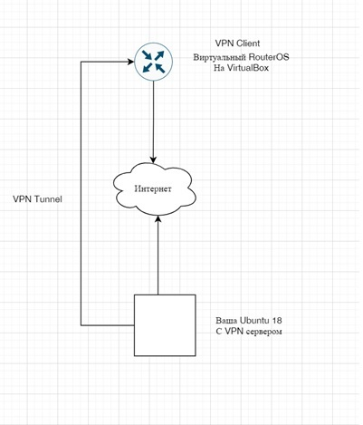

## Лабораторная работ №1 "Установка CHR и Ansible, настройка VPN

### Описание
Данная работа предусматривает обучение развертыванию виртуальных машин (VM) и системы контроля конфигураций Ansible а также организации собственных VPN серверов.

### Цель работы

Целью данной работы является развертывание виртуальной машины на базе платформы Microsoft Azure с установленной системой контроля конфигураций Ansible и установка CHR в VirtualBox


### Правила по оформлению

Правила по оформлению отчета по лабораторной работе вы можете изучить по [ссылке](../reportdesign.md)

### Ход работы

1. Вам необходимо развернуть вертуальную машину с помощью Microsoft Azure в режиме студенческой подписки

   > Если не получается в Microsoft Azure, можете выбрать любого бесплатного облачного провайдера

2. В бесплатном режиме Microsoft Azure предлагает для виртуальных машин только Ubuntu 16.4, нам нужна Ubuntu 18.+ поэтому необходимо обновить операционную систему. Сделать это можно с помощью данных команд:
   
```bash
sudo apt update & sudo apt ugprade
sudo do-release-upgrade
```

3. Теперь необходимо установить python3 и Ansible:
   
```bash
sudo apt install python3-pip
ls -la /usr/bin/python3.6
sudo pip3 install ansible
ansible --version
```

4. Далее вам необходимо на вашем компьютере установить VirtualBox а на него CHR (RouterOS).

   > В интернете есть инструкции по установке CHR на VirtualBox, одна из этих инструкций вам поможет.

5. После этого вам необходимо создать свой Wireguard/OpenVPN/L2TP сервер для организации VPN туннеля между вашим сервером автоматизации где был установлена система контроля конфигураций Ansible и вашим локальным CHR.

   > В интернете есть инструкции по установке Wireguard/OpenVPN/L2TP сервер для Ubuntu 18, одна из этих инструкций вам поможет.

6. После всех манипуляций вам необходимо будет поднять VPN туннель между вашим VPN сервером на Ubuntu 18 и VPN клиентом на RouterOS (CHR) 

   > Что искать? («Название вашего протокола» клиент RouterOS).

### Результаты лабораторной работы
В результате лабораторной работы у вас должна получиться схема связи следующего вида:



Также у вас будет:

- Виртуальная машина (**далее - сервер автоматизации**) с установленной системой контроля конфигураций Ansible в облачном сервисе Microsoft Azure и ваш компьютер с установленной на нем RouterOS в VirtualBox.
- VPN туннель между сервером автоматизации и вашим локальным CHR
- IP связность (это значит что вы можете попинговать свой CHR с сервера автоматизации)